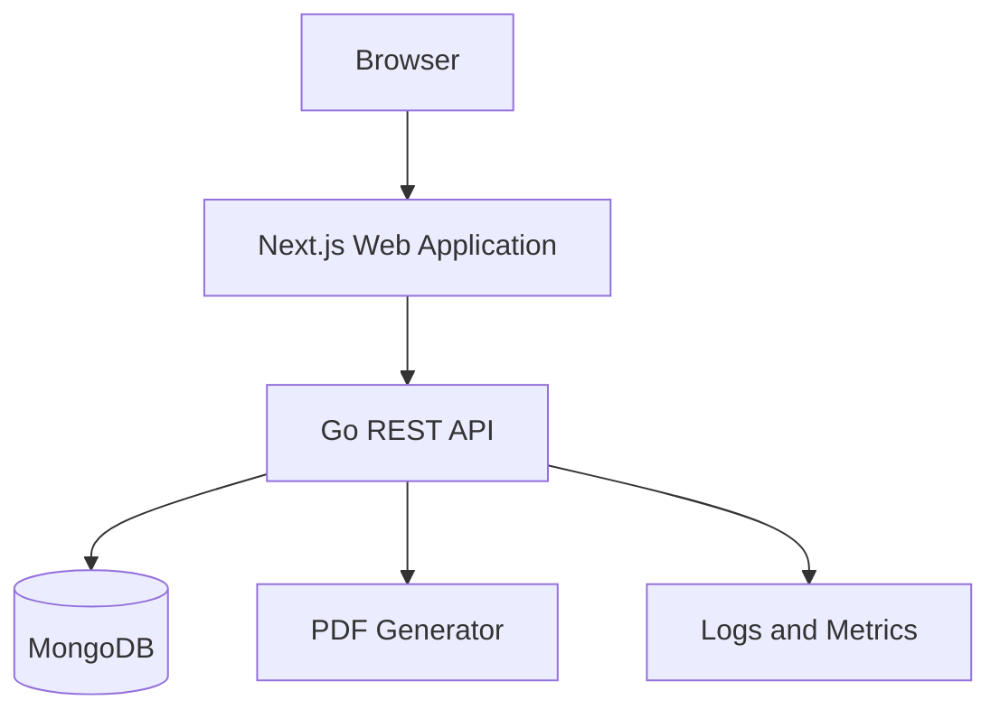
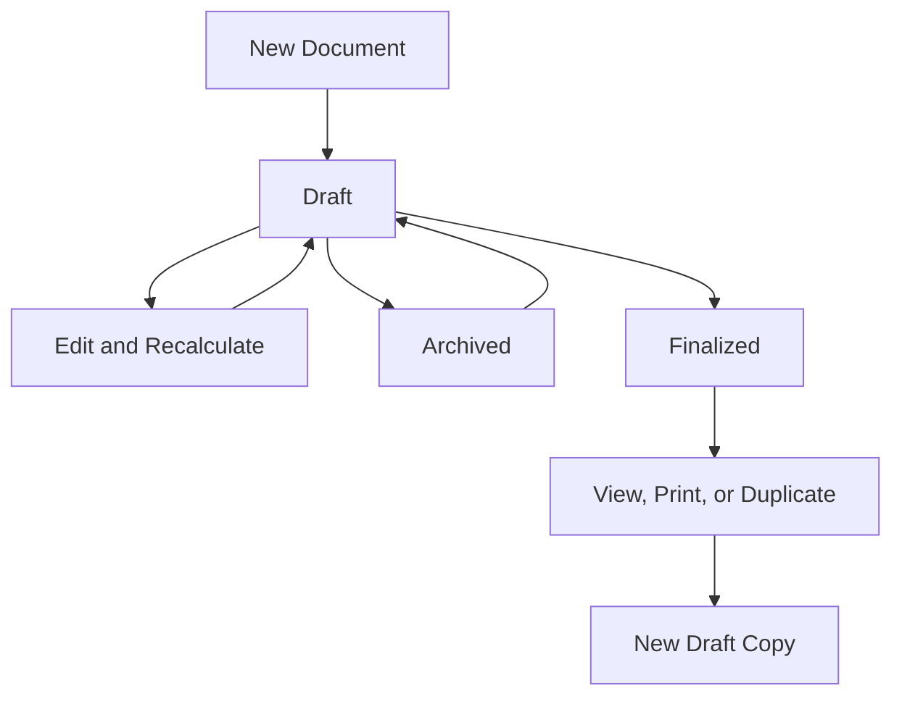

# DAFTAR (دَفْتَر) - SYSTEM DESIGN

**Version:** 1.0  
**Date:** 8 August 2026  
**Product:** Daftar  
**Architecture:** Next.js + Go + MongoDB

## Architecture summary

Daftar uses a separate Next.js frontend and Go REST API backed by MongoDB.



The Go API owns authentication enforcement, authorization, validation, calculation, persistence, finalization, reporting, audit recording, and PDF generation. Next.js owns presentation and user interaction but is never the authority for financial results.

## Proposed repository structure

```text
daftar/
  backend/
    cmd/api/
    internal/
      calculations/
      mercury/
      model/
      service/
      transport/web/
    Dockerfile
    go.mod
  frontend/
    app/
    components/
    features/
    lib/
  docs/
  compose.yaml
  Makefile
  README.md
  ENGINEERING_README.md
```

The API follows dependency direction:

```text
HTTP handler -> application service -> domain/calculation logic -> repository interface -> MongoDB adapter
```

Domain logic does not import HTTP or MongoDB packages.

## Component responsibilities

### Next.js application

- Registration and login forms
- Authenticated dashboard
- Document list, filtering, sorting, and pagination
- Draft editor with dynamic custom line items
- Server-result preview and calculation explanation
- Finalization confirmation
- Read-only finalized document view
- Reports, cards, and charts
- Print/PDF download initiation
- Consistent loading, empty, validation, and error states

The frontend may calculate a non-authoritative preview for responsiveness, but it must label it as a preview and replace it with the API result. Prefer calling a calculation-preview endpoint or debounced draft save to avoid duplicated rules.

### Go API

- Parse and authenticate requests
- Enforce user ownership
- Validate commands
- Calculate all totals
- Persist and retrieve documents
- Enforce lifecycle rules
- Manage optimistic concurrency and idempotency
- Run MongoDB aggregations for reports
- Generate PDFs from trusted stored records
- Emit structured logs and audit events

### MongoDB

- Store users, documents, audit events, counters, refresh sessions, and idempotency records
- Install strict MongoDB schema validators idempotently at startup, before indexes and services become ready
- Support document list and report query patterns through compound indexes
- Atomically update a single embedded document aggregate

## Trust boundaries

The browser is untrusted. The API ignores or rejects client-supplied values for:

- Line subtotal
- Discount amount
- Discounted amount
- Tax amount
- Line total
- Document totals
- Reference number
- Status
- Owner ID
- Finalized timestamp
- Audit data

Only raw inputs such as quantity, unit price, discount configuration, and tax rate are accepted.

## Authentication design

Recommended design:

- Email and password registration.
- Password hashing with Argon2id.
- Short-lived access token held in an `HttpOnly`, `Secure`, `SameSite=Lax` cookie.
- Rotating refresh session stored as a hashed token in MongoDB.
- CSRF protection for state-changing cookie-authenticated requests using an origin check plus CSRF token.
- Login and registration rate limiting by IP and normalized email.
- Logout revokes the refresh session and clears cookies.

If the deployment uses cross-site frontend/API domains, CORS must allow only the deployed frontend origin and credentials. Development origins are configured separately.

## Authorization design

Every document operation resolves with both identifiers:

```text
document._id = requested document ID
document.ownerId = authenticated user ID
```

The API never fetches a document by ID and checks ownership later when the query can enforce both. Unauthorized cross-user access returns `404 RESOURCE_NOT_FOUND`.

Audit, PDF, duplication, and report queries use the same owner scope.

## Calculation architecture

The `calculations` package is a pure deterministic module:

```go
CalculateDocument(input DocumentPricingInput) (DocumentPricingResult, error)
```

It:

- Accepts validated raw pricing inputs.
- Uses integer minor units and scaled percentage integers.
- Calculates line results independently.
- Applies the documented rounding policy.
- Aggregates document totals and tax breakdown.
- Has no network, database, clock, or framework dependency.

All create, update, preview, duplicate, finalize, report verification, and PDF paths consume stored results produced by this module.

## Document lifecycle



Drafts can be edited and recalculated. Finalized documents are view-only, but may be printed or duplicated into a new draft.

There is no transition from `finalized` to `draft` or `archived`.

### Lifecycle enforcement

Draft updates use a conditional MongoDB filter:

```text
_id = document ID
ownerId = authenticated user
status = draft
version = expected version
archivedAt = null
```

If no record matches, the service distinguishes not-found, finalized, archived, and version-conflict outcomes without revealing cross-user resources.

### Finalization

Finalization performs:

1. Validate idempotency key.
2. Load the owned draft at the expected version.
3. Validate that it contains at least one valid line.
4. Recalculate from raw stored inputs.
5. Conditionally set calculated values, `status=finalized`, and `finalizedAt`.
6. Increment version.
7. Append audit event.
8. Persist/replay the successful idempotent response.

Because the document and embedded lines are one MongoDB document, the critical lifecycle mutation is atomic. A transaction is used when the audit and idempotency writes must commit with it. The transaction is intentionally short and contains no external calls.

## Optimistic concurrency

Every mutable document has a monotonically increasing `version`.

- The API returns `version` with the document.
- PATCH and lifecycle commands require `If-Match` or an `expectedVersion` field.
- The update filter includes the expected version.
- A mismatch returns `409 DOCUMENT_VERSION_CONFLICT`.

This prevents two browser tabs from silently overwriting each other.

## Idempotency

Finalization and duplication accept an `Idempotency-Key` scoped to user, HTTP method, and route.

An idempotency record stores:

- Request fingerprint
- Processing/completed state
- Response status and safe response body
- Resource ID
- Expiry time

Reusing a key with a different request returns `409 IDEMPOTENCY_KEY_REUSED`. A completed identical request replays the original response.

## Document references

References use the format `DOC-YYYY-NNNNNN`.

A per-user, per-year counter is incremented atomically using `findOneAndUpdate` with `$inc` and `upsert`. A unique compound index prevents duplicate references. Sequence gaps are acceptable; reuse is not.

## PDF generation

`GET /documents/{id}/pdf`:

1. Authenticates the user.
2. Loads the owned stored document.
3. Renders metadata, lines, totals, tax breakdown, and status.
4. Adds a `DRAFT` marker for drafts.
5. Streams `application/pdf` with a safe filename.
6. Records a non-blocking or transactional audit event according to implementation complexity.

The PDF generator receives the stored domain view model, not client HTML or client-calculated values.

## Reporting

Report input is a validated inclusive issue-date range, optional currency, and optional preset resolved by the frontend.

MongoDB aggregation filters on:

```text
ownerId
status = finalized
archivedAt = null
issueDate between from and to
optional currency
```

It groups monetary totals by currency and tax rates. Timeline output groups by calendar month in the user's selected reporting timezone. The initial UI defaults to UTC or a configured timezone and documents this assumption.

No report combines different currencies.

## Audit design

Audit events are append-only application records. They contain action codes and limited metadata rather than full document snapshots.

Material changes include a changed-field list and before/after version, not sensitive secrets or entire request bodies. Finalization captures the final document version and totals checksum or pricing-engine version for traceability.

Audit creation must not allow user-controlled action names, actor IDs, or timestamps.

## Error model

All errors use:

```json
{
  "error": {
    "code": "DOCUMENT_FINALIZED",
    "message": "Finalized documents cannot be modified.",
    "details": {
      "documentId": "..."
    },
    "requestId": "req_..."
  }
}
```

Validation errors include field paths and actionable messages. Internal errors return a stable public message while detailed diagnostics stay in structured logs.

## Security controls

- Argon2id password hashing
- Strict ownership filters
- HttpOnly secure cookies and CSRF defense
- Input size and line-count limits
- JSON body limits
- Authentication rate limiting
- Allowed-origin CORS policy
- Secrets supplied through environment/secret management
- No secrets or tokens in logs
- PDF filename sanitization
- Formula injection prevention if CSV export is later added
- Security headers in Next.js and API responses
- Dependency and container scanning in CI where available
- Least-privilege database credentials
- Separate production and development databases
- Backups and restore procedure documented for production

## Observability

- Structured JSON logs with request ID, route, status, latency, and safe actor/resource IDs
- Health endpoints: liveness and readiness
- Metrics for request latency, error rate, finalization failures, report latency, and MongoDB operations
- Error reporting for unhandled API and frontend exceptions
- Audit events remain distinct from operational logs

## Deployment

Suggested topology:

- Next.js: Vercel or an AWS-hosted Node runtime
- Go API: AWS App Runner/ECS or a simple managed container service
- MongoDB: MongoDB Atlas with network controls and backups
- CI/CD: GitHub Actions for lint, tests, builds, and deploy gates

For deadline safety, the exact providers may change, but the public web application must use HTTPS and the API must restrict origins.

## Scalability notes

- Embedded line items keep document reads and lifecycle writes atomic; enforce a maximum number of lines to avoid unbounded document growth.
- Report and list indexes match user/date/status query patterns.
- Cursor pagination avoids deep skip costs at scale.
- PDF generation can move to a background job/object store when volume grows.
- Audit events are separate to avoid unbounded arrays in document records.
- Long-running external calls never occur inside database transactions.
